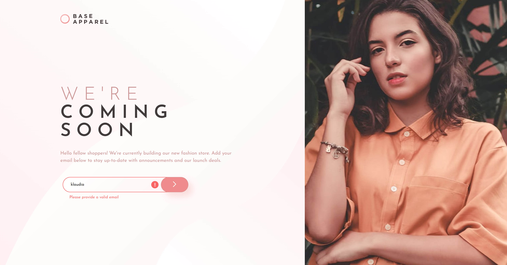
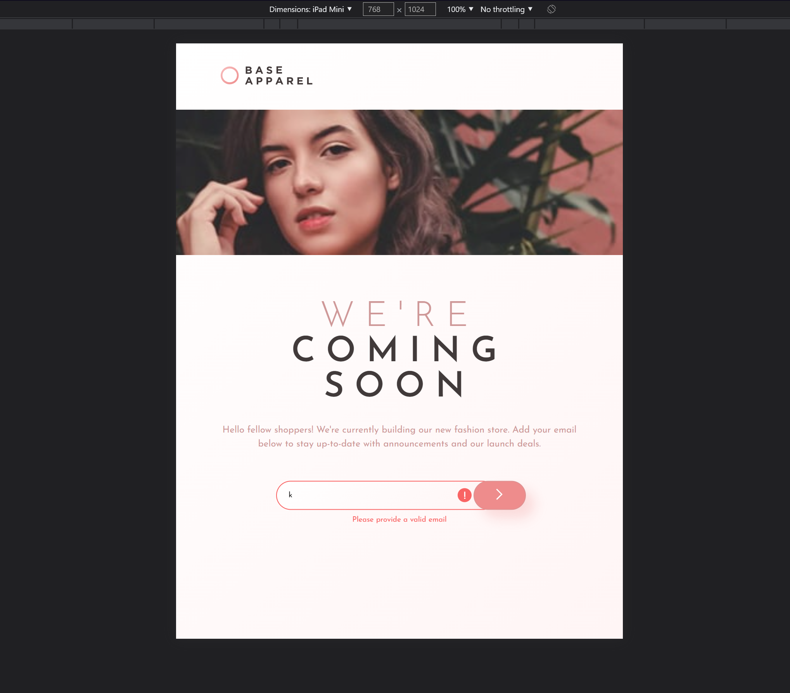
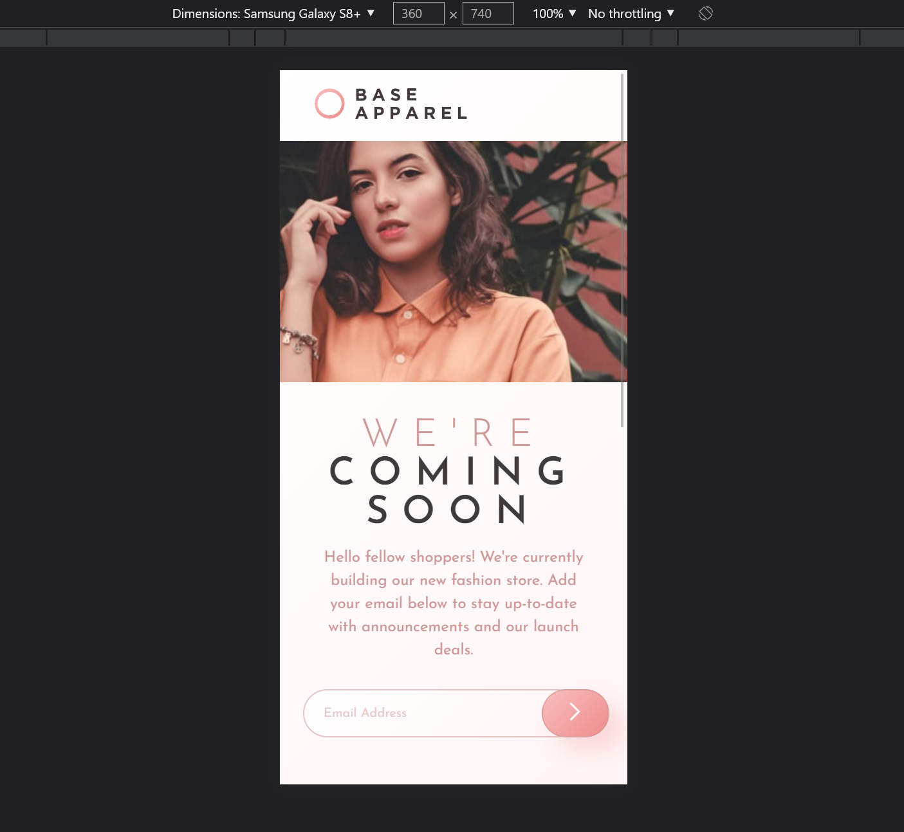
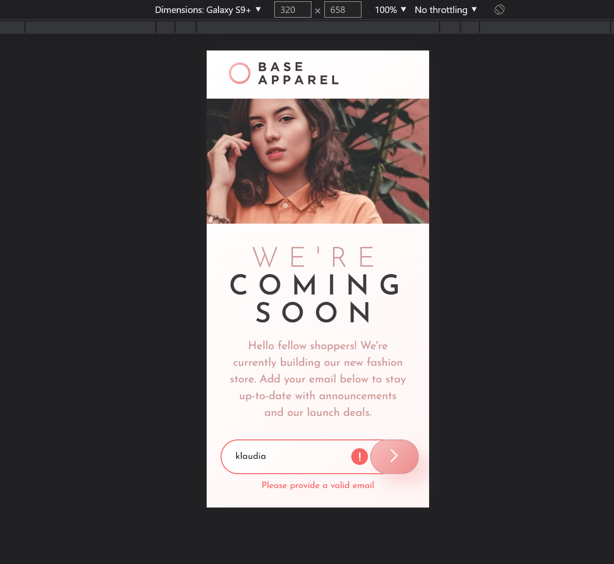

# Frontend Mentor - Base Apparel coming soon page

## Welcome! 👋

This is my next project with HTML CSS and JavaScript. I was learning how manipulate elements by DOM and how to made simple form email validator.

Im still learning how to properly make responsive devices so I met some issues.

## Two issues

I have two problems with small devices.
First problem is with scrollbar in smartphone. When I hidden scrollbar I realize that devices with less high just cut content. But in the same time when I added overflow-y to solve this, I got huge empty space under content. I tried figure out what going on but I didnt have any idea how to fix it. So Ive just picked "lesser evil" because when I was making mobile layout I didnt have a script yet.

The next issue is form on screen size like tablets. I had problem with center it and I tried some solutions but it didnt work so I used position fixed and translate to put in right place. Ofc in some screens it dont look great but still better than before.

I will appreciate if someone can take a look to code and tell me whats wrong with it.

[Frontend Mentor](https://www.frontendmentor.io)

---

## My design

- Desktops

- Tablets etc.

- Smartphones

